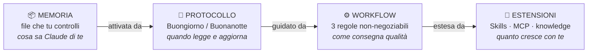
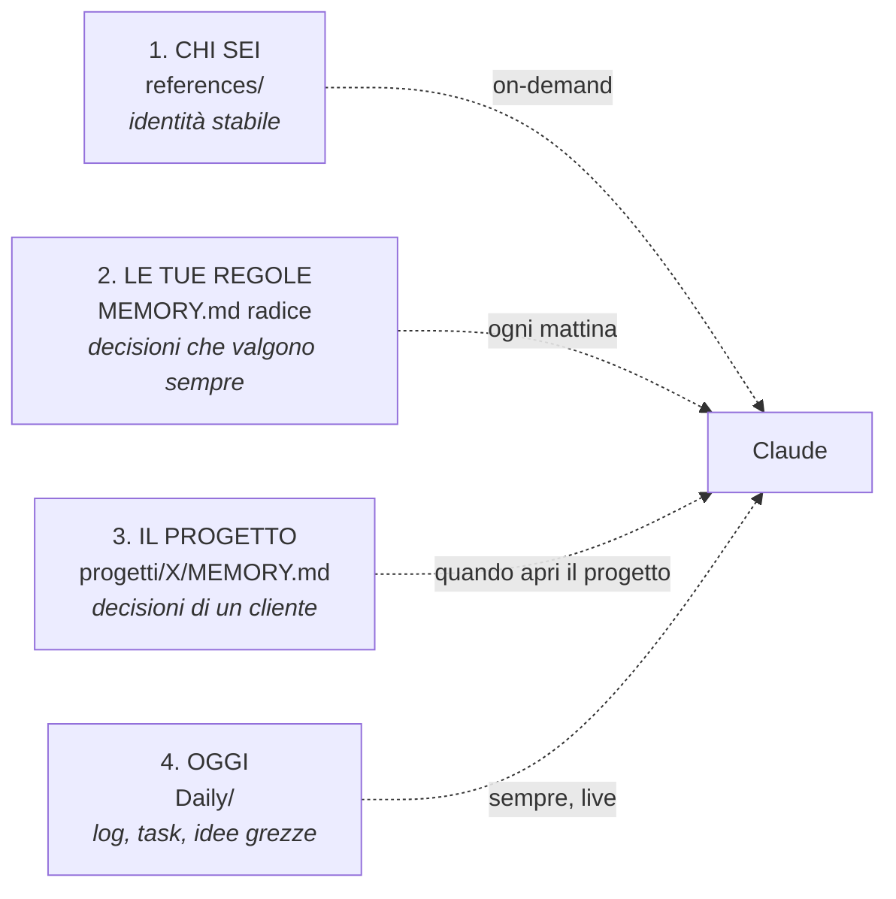

# Claude Second Brain

> **Non solo una memoria — un sistema operativo personale per lavorare con Claude.**
> Memoria, protocollo, workflow, estensioni: tutto in file che tu controlli.
> Setup in 5 minuti. Funziona con qualsiasi piano Claude.

> 🆕 **Sei alle prime armi con Cowork / Claude Code / Git?** Vai prima alla [guida passo-passo per dummies](docs/installazione-per-dummies.md).

---

## Lunedì mattina, 12ª sessione

Apri Claude per lavorare su un cliente.

E come sempre, prima di iniziare, gli riscrivi *chi sei, su cosa stai lavorando, che decisioni avete preso insieme*. Tono, vincoli, preferenze del cliente: tutto. Lui risponde bene. Come sempre.

Però la cosa che hai appena scritto, la sapevi già tu. Lui l'ha dimenticata appena la sessione si è chiusa.

Per chi usa Claude per una curiosità occasionale, non è un problema. Per chi ci lavora — consulenti, freelancer, content creator, formatori — è un tetto: non puoi andare in profondità su un cliente, perché il contesto evapora ogni volta.

Questo framework rovescia la dinamica. **La tua conoscenza vive in file che tu controlli**, e Claude li legge quando serve. Niente memoria magica delegata all'AI. La memoria diventa leggibile, modificabile, versionabile.

E mentre risolvi la memoria, costruisci anche un *modo di lavorare* con Claude — un sistema operativo personale.

---

## Cosa cambia, in concreto

**Prima** — apri Claude e scrivi:

```
Sono Anna, faccio la consulente HR. Lavoro con Rossi Srl da 3 mesi
sulla selezione di 5 figure tecniche, abbiamo deciso di evitare
i test psico-attitudinali (te l'avevo detto due settimane fa,
ricordi?), preferiamo colloqui strutturati. Aiutami a preparare
la traccia per il colloquio di domani.
```

Lui ti risponde bene. Ma 10 minuti di "io ti dico" ogni volta. E "ricordi?" è retorico — lui non ricorda.

**Dopo** — apri Claude e scrivi:

```
Buongiorno Claude
```

Lui legge i tuoi file. Risponde:

```
Sessione 47 aperta. Cosa facciamo?

Vedo che hai 3 progetti attivi: Rossi Srl (selezione tecnica),
Bianchi (corso onboarding), Verdi (revisione JD). Ieri sera
avevi annotato che oggi tocca la traccia del colloquio Rossi.
Procediamo da lì?
```

Niente briefing. Solo lavoro.

---

## I 4 componenti del sistema

Il framework non finisce alla memoria. Ha **4 componenti** che lavorano insieme:



I 4 pezzi non sono indipendenti: la memoria senza protocollo si fossilizza, il protocollo senza workflow è cerimonia, il workflow senza estensioni resta locale. Tutti insieme, è un OS.

Adesso vediamoli uno per uno.

---

## 📦 Componente 1: Memoria

**Cos'è.** La conoscenza di te e del tuo lavoro che vive in file `.md` dentro la cartella `vault/`. Ogni decisione, ogni preferenza, ogni vincolo di un cliente è scritto da qualche parte e Claude può leggerlo.

**Perché serve.** Senza, ogni sessione ricomincia da zero. Con, Claude apre la mattina già al corrente di tre clienti attivi, della call di questa settimana, della decisione presa la settimana scorsa sull'approccio formativo.

**Come è organizzata.** Non un solo file enorme. Quattro strati con ruoli diversi e frequenze di caricamento diverse.



### Strato 1 — Chi sei (`references/`)

Il livello più stabile. Cambia di rado: una volta scritto bene, dura mesi.

Sta in `references/chi-sono.md` (e altri file opzionali come `stile-scrittura.md`, `icp.md`, `posizionamento.md`). Caricato **on-demand**: Claude lo legge quando il task lo richiede (es. quando devi scrivere un contenuto in tono coerente, lui carica `stile-scrittura.md`). Non viene letto all'apertura di sessione: sarebbe spreco di contesto.

Esempio reale di `references/chi-sono.md`:

```markdown
Sono Anna Bianchi, consulente HR per piccole aziende del Veneto.
Mi occupo soprattutto di selezione tecnica e onboarding.
Tono di lavoro: diretto, pratico. Niente PowerPoint quando basta una mail.
Strumenti: Notion per i progetti, Google Workspace per la comunicazione.
```

### Strato 2 — Le tue regole (`MEMORY.md` radice)

Decisioni e lezioni che valgono trasversalmente a tutti i progetti. Non "il progetto X usa Y" — quello è strato 3. Qui sta "io non lavoro nei weekend", "il mio fornitore X è inaffidabile", "uso sempre questo template per le proposte".

Sta in `vault/MEMORY.md`. Caricato **ogni mattina** quando dici *Buongiorno Claude*. È la "RAM persistente" del sistema.

Esempio reale di `MEMORY.md`:

```markdown
## 2026-04-12 — Stack di lavoro
Per le proposte uso Pages, non Word. Ho un template a 3 sezioni
(contesto, soluzione, costi). Mai allegare il PDF + il sorgente
nello stesso messaggio.

## 2026-04-18 — Linguaggio
Quando mi rivolgo a un'azienda manifatturiera evito "asset",
"deliverable", "stakeholder". Funziona "macchinari", "consegne",
"interlocutori".
```

Disciplina importante: max 15-20 entry per sezione. Se cresce, condensa le più vecchie.

### Strato 3 — Il progetto (`progetti/X/MEMORY.md`)

Il contesto specifico di un singolo cliente, corso, idea o canale. Decisioni che valgono per quel progetto e non per gli altri.

Sta in `progetti/[nome-progetto]/MEMORY.md`. Caricato **solo quando apri quel progetto**. Quando lavori su Rossi Srl, Claude carica il MEMORY di Rossi Srl, non quello di Bianchi.

Esempio reale di `progetti/rossi-srl/MEMORY.md`:

```markdown
## 2026-03-20 — Approccio selezione
Su Rossi Srl evitiamo test psico-attitudinali. Preferiamo colloqui
strutturati su 4 dimensioni (competenze tecniche, problem solving,
fit culturale, motivazione). Non rimettere in discussione.

## 2026-04-08 — Budget formazione
Marco (HR) ha confermato budget 8k per il corso onboarding 2026.
Coprire 6 figure entro settembre.
```

### Strato 4 — Oggi (`Daily/`)

Il log della giornata, i task attivi, le idee grezze, gli appunti che potrebbero o non potrebbero maturare. Il flusso live.

Sta in `vault/Daily/`:
- `Daily/Journal/2026-05/2026-05-07.md` — il diario di oggi (Claude scrive il riassunto la sera)
- `Daily/Appunti/sparks.md` — le idee buttate giù di getto
- `Daily/Task/hub.md` — i task senza progetto
- `Daily/Task/attivi.md` — la board aggregata (richiede Obsidian Tasks)

Caricato **sempre, live**. È il flusso operativo dove succedono le cose prima di sedimentare nei layer più stabili.

### La regola della promozione

Le cose nascono quasi sempre nello strato 4 (un'idea, una decisione presa al volo durante la giornata). Se una cosa **ritorna** — la riscrivi, la rivedi, la trovi rilevante — sale di strato:

`sparks` (strato 4) → `MEMORY.md` di un progetto (strato 3) → `MEMORY.md` radice (strato 2) → `references/` (strato 1)

Le promozioni le fai a mano, perché sono giudizi di valore, non automazioni. Il sistema non promuove al posto tuo — *tu* decidi quando una nota grezza è diventata stabile abbastanza da meritare un livello superiore.

### Chi scrive cosa

Una distinzione importante: **chi è responsabile di scrivere ogni strato**?

| Strato | Lo scrivi tu | Claude propone, tu confermi |
|---|:---:|:---:|
| 1. Chi sei (`references/`) | ✅ | — |
| 2. Le tue regole (`MEMORY.md`) | — | ✅ (la sera) |
| 3. Progetti (`progetti/X/`) | — | ✅ (la sera) |
| 4. Oggi (`Daily/`) | ✅ (idee grezze in `sparks.md`) | ✅ (riassunto sessione la sera) |

Claude **non scrive mai in memoria a tua insaputa**. Propone sempre, tu confermi o correggi. Questa è la differenza tra "memoria che controlli" e "memoria magica".

---

## 🔄 Componente 2: Protocollo di sessione

**Cos'è.** Due frasi rituali — una in apertura, una in chiusura — che attivano la lettura e la scrittura della memoria. Senza il protocollo, la memoria c'è ma non viene letta o aggiornata in modo sistematico.

**Perché serve.** Le decisioni si prendono durante la giornata. Senza un protocollo di chiusura, restano nel diario della sessione e non sedimentano. Il giorno dopo, sono perse.

### Buongiorno Claude (apertura)

Tu scrivi:

```
Buongiorno Claude
```

Cosa succede dietro le quinte:
1. Claude legge `vault/CLAUDE.md` (le istruzioni di routing)
2. Legge `vault/MEMORY.md` radice — strato 2
3. Apre o crea `vault/Daily/Journal/2026-05/2026-05-07.md` — strato 4 di oggi
4. Risponde con la situazione: che progetti hai attivi, cosa avevi annotato come "da fare oggi", se c'è una call calendarizzata

Esempio di apertura:

```
Sessione 47 aperta. Cosa facciamo?

Vedo che hai 3 progetti attivi: Rossi Srl (selezione tecnica),
Bianchi (corso onboarding), Verdi (revisione JD). Ieri sera
avevi annotato che oggi tocca la traccia del colloquio Rossi.
Procediamo da lì?
```

Da qui parti. Niente briefing.

### Buonanotte Claude (chiusura)

A fine giornata scrivi:

```
Buonanotte Claude
```

Cosa succede:
1. Claude scrive un riassunto della sessione nel daily di oggi
2. Rilegge la conversazione cercando 0–3 cose che meritano di sedimentare
3. Te le **propone** (non scrive da solo)
4. Tu rispondi con sì/no/correggi per ognuna
5. Lui aggiorna i file giusti

Esempio di chiusura:

```
Oggi abbiamo discusso 3 cose nuove. Vuoi che salvi qualcuna in memoria?

1. Marco di Rossi Srl preferisce essere contattato via WhatsApp
   per le urgenze, mai per email. → memoria del progetto?
2. Hai deciso che la traccia colloquio Rossi parte sempre con
   un caso pratico, mai con domande generali. → regola di sistema?
3. La call di ieri con Bianchi è da rivedere settimana prossima
   (lui era distratto). → solo nota nel daily?

Dimmi sì/no per ognuna o correggi.
```

Tu rispondi `1 sì, 2 sì, 3 nota nel daily`. Lui aggiorna `progetti/rossi-srl/MEMORY.md` (1), `vault/MEMORY.md` (2), il daily di oggi (3). Costo totale: 60 secondi.

### Costo e valore

**Costo del protocollo**: 30 secondi la mattina + 60 secondi la sera. 90 secondi al giorno. ~10 minuti a settimana.

**Valore**: la memoria si aggiorna senza che tu debba ricordartene. La prossima volta che apri Rossi Srl, le decisioni di oggi sono già lì.

---

## ⚙️ Componente 3: Workflow

**Cos'è.** Tre regole non-negoziabili che definiscono *come* Claude lavora con te per consegnare qualità — e una "Filing Rule" che decide *dove va* ogni cosa che produci.

**Perché serve.** La memoria + il protocollo da sole non bastano. Senza un workflow chiaro, Claude esporta documenti senza farti rivedere la bozza, scarica file in posti casuali, dice "fatto" senza aver verificato. Le 3 regole impediscono questi tre fallimenti specifici.

### Regola 1 — La Regola della Bozza

**Il principio**: scrivi sempre prima nel vault come `.md`. Aspetta il *"ok produci"* prima di esportare in Word, PDF, slide, o qualunque file binario.

**Perché**: saltare la bozza è la causa principale di "12 versioni di un file invece di iterare sulla bozza". Quando Claude esporta in PDF al primo tentativo, ogni piccola correzione genera un nuovo file invece di un'iterazione sul testo.

**Esempio**:

```
Tu: Prepara la proposta per Rossi Srl per la selezione del CTO.
Claude: Ho preparato la bozza in vault/progetti/rossi-srl/proposta-cto-bozza-v1.md.
        Vuoi rileggerla prima che la esporti in PDF, o procedo direttamente?
Tu:    Aspetta, leggo. → [revisione]
Tu:    Aggiungi una sezione sui tempi e la struttura tariffaria.
Claude: Aggiornata. Vuoi rileggere prima dell'export?
Tu:    Sì. → [revisione] → "ok produci pdf"
Claude: Esportato in output/Idee/rossi-srl/rossi-srl_proposta-cto_v1.pdf.
```

**Eccezioni**: richiesta diretta di binario ("fammi il pptx"), input dal cliente, modifica puntuale a un deliverable esistente.

### Regola 2 — La Regola 01 (invariante di progetto)

**Il principio**: ogni progetto, indipendentemente dal tipo (cliente, corso, idea, canale), ha la stessa struttura. Sempre.

```
progetti/[nome-progetto]/
├── [nome-progetto].md     ← MOC: l'hub che linka a tutto
├── CLAUDE.md              ← istruzioni specifiche per Claude
├── MEMORY.md              ← decisioni datate del progetto
├── tasks.md               ← task locali (formato Obsidian Tasks)
└── knowledge/             ← documenti di riferimento, transcript call
    └── calls/             ← trascrizioni meeting (opzionale)
```

**Perché**: due ragioni. (1) Claude sa **sempre** cosa caricare quando apri un progetto, senza dover esplorare. (2) Tu puoi muoverti tra progetti diversi senza imparare layout diversi.

**Esempio**: hai 12 progetti attivi. Aprire uno qualsiasi è identico — i 4 file (MOC, CLAUDE, MEMORY, tasks) stanno sempre negli stessi posti, hanno gli stessi nomi. Niente "dove avevo messo le note di...".

### Regola 3 — Verify-or-redo

**Il principio**: dopo ogni modifica, verifica davvero il risultato dal punto di vista di chi userà l'output. Mai dire "fatto" se non è vero.

**Perché**: Claude tende a dire "fatto" basandosi su come la modifica *sembra*, non su come *funziona*. Se hai aggiunto una colonna a un foglio Excel, devi davvero aprirlo e vedere se la colonna c'è e ha i numeri giusti. Se hai modificato un PDF, devi davvero aprirlo e leggerlo.

**Esempio**:

```
Claude: Ho aggiunto la sezione "Tempi" alla proposta. Fatto.
Tu:    Hai riaperto il file PDF e verificato che la sezione c'è davvero?
Claude: ...no. Apro adesso. → [verifica] → Sì, la sezione c'è. Confermo: fatto.
```

Sembra pedante. Non lo è — è quello che separa un sistema affidabile da uno "che sembrava funzionare".

### La Filing Rule (dove va questa cosa?)

Una sub-regola del workflow: ogni elemento ha **un solo posto giusto**. Quando produci qualcosa o annoti qualcosa, segui la regola del *first match*: usa il primo posto che combacia, non cercare il "migliore".

| Cosa devo salvare | Dove va |
|---|---|
| Identità stabile (chi sei, voce, ICP) | `references/` |
| Decisione che vale per più progetti | `MEMORY.md` (radice) |
| Decisione di un singolo cliente | `progetti/X/MEMORY.md` |
| Idea grezza che potrebbe non maturare | `Daily/Appunti/sparks.md` |
| Task del progetto X | `progetti/X/tasks.md` |
| Task senza progetto | `Daily/Task/hub.md` |
| Riassunto della sessione di oggi | `Daily/Journal/YYYY-MM-DD.md` |
| Trascrizione call | `progetti/X/knowledge/calls/YYYY-MM-DD-titolo.md` |
| File binario (Word, PDF, slide) | `output/[area]/[progetto]/` (fuori dal vault) |

In dubbio? Scegli il livello più operativo (`Daily/`) e lascia che la regola di promozione lo faccia salire. È più facile promuovere dal basso che ridiscendere da troppo in alto.

---

## 🧩 Componente 4: Estensioni

**Cos'è.** Moduli che estendono il sistema base — skill, connettori MCP, knowledge profondi. Si aggiungono *quando il caso d'uso lo giustifica*, non prima.

**Perché serve.** Il sistema base (memoria + protocollo + workflow) ti porta lontano. Ma a un certo punto vuoi automatizzare cose specifiche, integrarti con tool esterni, o gestire grandi volumi di documenti. Lì entrano le estensioni.

### Skill

**Cosa sono.** File `.md` con istruzioni che Claude carica quando le invochi. Vivono in `skills/[nome]/SKILL.md`.

**Le 3 skill incluse nel template**:

| Skill | Cosa fa |
|---|---|
| **`setup-wizard`** | Wizard di configurazione iniziale. Ti fa 5 domande e popola `CLAUDE.md`, `MEMORY.md`, `chi-sono.md`. È quello che usi al primo clone del repo. |
| **`session-lifecycle`** | Definisce cosa succede dietro al "Buongiorno Claude" / "Buonanotte Claude". È il cervello del protocollo di sessione. |
| **`vault-lint`** | Controlli di salute del vault: link rotti, file orfani, MEMORY.md cresciuti troppo. Lo lanci una volta a settimana o a mese. |

**Skill che puoi aggiungere tu** (esempi reali):
- `meet-sync` — importa trascrizioni call da Granola/Otter/Fireflies in `progetti/X/knowledge/calls/`
- `pipeline-content` — workflow strutturato per scrivere un contenuto (curatore → redattore → penna → editor)
- `inbox-sync` — pulizia automatica della inbox con archiviazione nel vault

Quando aggiungi una skill, basta creare `skills/[nome]/SKILL.md` con le istruzioni. Claude la trova e la usa quando la invochi.

### Connettori MCP

**Cosa sono.** Plugin che permettono a Claude di parlare con tool esterni. **Vivono sopra il framework**, non dentro: il framework dà la struttura della memoria, gli MCP danno l'accesso ai dati esterni.

**Esempi tipici**:
- **Gmail** — leggere/scrivere bozze email senza copiarle a mano
- **Calendar** — leggere gli appuntamenti, creare nuovi eventi
- **Asana / Notion / Linear** — sincronizzare task tra il vault e il PM tool
- **Stripe / QuickBooks** — leggere fatture, generare report finanziari
- **Slack** — leggere/scrivere messaggi

Il framework non installa MCP per te — li configuri da Claude/Cowork quando ne hai bisogno. Però **predispone**: il setup-wizard ti chiede quali tool usi e annota in `MEMORY.md` quali vorrai automatizzare in futuro. Quando arriva il momento, parti da una lista già pronta.

### Knowledge profondi

**Cosa sono.** Documenti tecnici, trascrizioni, riferimenti che vivono in `progetti/X/knowledge/`. Sono caricati **on-demand** — solo quando il task lo richiede.

**Esempi**:
- `progetti/rossi-srl/knowledge/calls/2026-04-08-marco-budget.md` — trascrizione call
- `progetti/rossi-srl/knowledge/contratti/MSA-2026.md` — il contratto firmato
- `progetti/corso-ai/knowledge/syllabus-base.md` — il piano del corso
- `progetti/cliente-y/knowledge/dati/fatture-2026.csv` — dati operativi

La differenza con i 4 strati di memoria: la memoria è **decisione** ("abbiamo deciso X"). Il knowledge è **documento** ("ecco la trascrizione completa", "ecco il contratto"). La memoria distilla, il knowledge conserva.

### Quando aggiungere estensioni

**Mai al day 1.** Il sistema base funziona da solo. Aggiungere skill custom o MCP prima che la disciplina dei layer 1-2 sia diventata abitudine è un anti-pattern: ti sovraccarichi e abbandoni il sistema dopo due settimane.

Una regola pratica:

| Fase | Cosa funziona | Cosa NON serve ancora |
|---|---|---|
| **Day 1** | Setup wizard, primo "Buongiorno Claude" | Niente skill custom, niente MCP |
| **Week 1** | 1-2 progetti reali aperti con la Regola 01 | Niente top-level multiple, niente integrazioni |
| **Month 1** | 3-5 progetti, 10-15 entry MEMORY | Niente skill personalizzate |
| **Month 3** | Eventuali skill custom (meet-sync, vault-lint regolare) | Niente connettori MCP complessi |
| **Year 1** | Connettori MCP per workflow autonomi (Gmail, Calendar, Asana) | — sei a regime |

Resistere alla tentazione di costruire le estensioni prima della disciplina. È la differenza tra un sistema che usi e uno che ti pesa.

---

## Setup in 5 minuti

> Versione passo-passo per chi non ha mai usato Cowork/Git/Terminal: [`docs/installazione-per-dummies.md`](docs/installazione-per-dummies.md). Include anche il metodo "scarica ZIP, niente Git".

**1. Clona il repo**

```bash
git clone https://github.com/valegro92/claude-second-brain.git
cd claude-second-brain
```

**2. Apri la cartella in Cowork o Claude Code**

- **Cowork**: aggiungi la cartella dalle impostazioni cartelle
- **Claude Code**: `claude` da terminale nella cartella

**3. Lancia il setup-wizard**

Incolla questo nella chat con Claude:

```
Leggi skills/setup-wizard/SKILL.md e segui le istruzioni
per configurare il mio secondo cervello. Ho appena clonato
il template e voglio adattarlo al mio caso.
```

Il wizard ti farà 5 domande di base (chi sei, su cosa lavori, come vuoi che ti parli, cosa non vuoi rispiegare, come scrivi) e — se vuoi — 3 domande aggiuntive per progetti reali, trascrizioni meeting e automazioni future. Compila i tuoi file con le tue risposte. ~10 minuti.

**4. Testa**

Apri una **nuova chat** in Cowork. Scrivi: `Buongiorno Claude`

Se risponde *"Sessione 1 aperta. Cosa facciamo?"* — funziona.

**5. (Opzionale) Apri il vault in Obsidian**

Il vault è progettato anche per [Obsidian](https://obsidian.md):
- Apri Obsidian → "Apri cartella come vault" → seleziona la cartella `vault/`
- Plugin consigliati: **Obsidian Tasks** (board) + **Templates** (daily)

Funziona lo stesso senza Obsidian — perdi solo la visualizzazione grafica.

> Per il dettaglio passo-passo: [`INIZIA-QUI.md`](INIZIA-QUI.md).

---

## Aggiungere un nuovo cliente / corso / idea

```bash
cp -r vault/progetti/_esempio vault/progetti/nome-cliente
```

Poi di' a Claude: *"Ho aggiunto nome-cliente in progetti, puoi aiutarmi a compilare il MOC?"* — in 5 minuti hai la struttura del progetto in piedi.

Vedi [`docs/aggiungere-un-progetto.md`](docs/aggiungere-un-progetto.md) per il dettaglio.

---

## Cosa NON è

- **Non è un'integrazione automatica con tool esterni** (Gmail, Slack, Stripe, gestionali). Per quelli servono i connettori MCP, che vivono *sopra* il framework. Il framework dà la struttura della memoria; gli MCP danno l'accesso ai dati.
- **Non è una memoria magica**. È una struttura di file che tu mantieni con disciplina. Se non scrivi nulla, il sistema è vuoto.
- **Non è specifico di Claude**. Il pattern funziona con qualunque LLM che sappia leggere file. Ottimizzato per Claude perché è il caso d'uso primario.

---

## FAQ

**Devo usare Obsidian?** No. Il vault è solo una cartella di `.md`. Obsidian aggiunge grafo e plugin task, ma il framework gira anche da editor di testo qualsiasi.

**Posso usarlo con ChatGPT, Gemini, ecc.?** Sì, la struttura è agnostica. Cambia solo il modo in cui carichi i file in sessione.

**Quanto tempo per vedere valore?** Setup 10 minuti. Il primo *"Buongiorno Claude"* funziona già il giorno stesso. Il valore composto cresce nel tempo: dopo 2-3 settimane è quando il sistema inizia davvero a ricordare per te decisioni di un mese fa.

**E se non lo uso ogni giorno?** Funziona lo stesso. Il valore è proporzionale alla frequenza, ma anche 3 sessioni a settimana fanno la differenza nel giro di un mese.

**Posso avere più top-level (es. Lavoro/, Contenuti/, Formazione/)?** Sì, è l'estensione naturale quando il numero di progetti cresce. Vedi `docs/da-base-a-avanzato.md` (in arrivo).

**Sono al sicuro? Dove vivono i miei dati?** I file vivono **sul tuo computer**. Claude li legge solo durante la sessione attiva. Non vengono caricati su server esterni a meno che tu non li carichi esplicitamente.

**Quanto del mio tempo dedico al sistema?** ~90 secondi al giorno (Buongiorno + Buonanotte) + 5-10 min a settimana per condensare MEMORY.md. Il resto del tempo è il lavoro normale che faresti comunque, solo con Claude allineato.

---

## Documentazione

| Documento | Quando leggerlo |
|---|---|
| [`README.md`](README.md) (sei qui) | Prima volta — capisci di cosa si tratta e come funziona |
| [`INIZIA-QUI.md`](INIZIA-QUI.md) | Dopo aver clonato — il prompt da incollare |
| [`docs/guida-formazione.md`](docs/guida-formazione.md) | **Guida completa**: installazione + logica del sistema + `.md` + grafo — tutto in un documento |
| [`docs/installazione-per-dummies.md`](docs/installazione-per-dummies.md) | Solo installazione, passo-passo, per chi non ha mai aperto un Terminal |
| [`docs/guida-markdown-e-grafo.md`](docs/guida-markdown-e-grafo.md) | File `.md` e grafo Obsidian in profondità |
| [`docs/framework.md`](docs/framework.md) | Spiegazione tecnica completa — analogia OS, layer L0–L3, regole |
| [`docs/aggiungere-un-progetto.md`](docs/aggiungere-un-progetto.md) | Per ogni nuovo cliente/corso/idea |

---

## Licenza

MIT. Issue e PR benvenute — se adatti il framework al tuo caso e trovi un pattern utile, apri una issue per discuterne.

---

## Crediti

- **[Dario Vignali](https://dariovignali.substack.com)** — metodologia del secondo cervello in Obsidian
- **[Valentino Grossi](https://lacassettadegliaitrezzi.substack.com)** — adattamento per Claude e uso professionale

*Repository: [github.com/valegro92/claude-second-brain](https://github.com/valegro92/claude-second-brain)*
