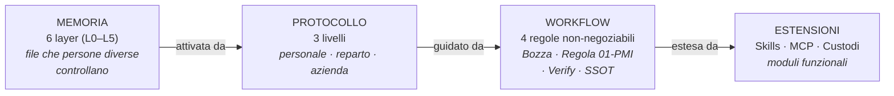
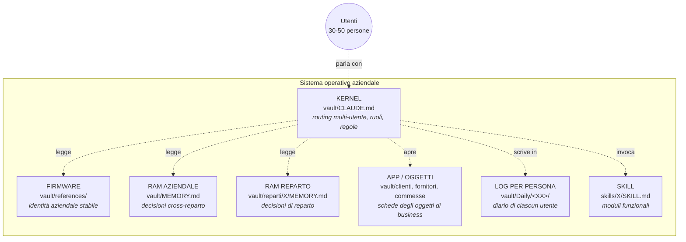
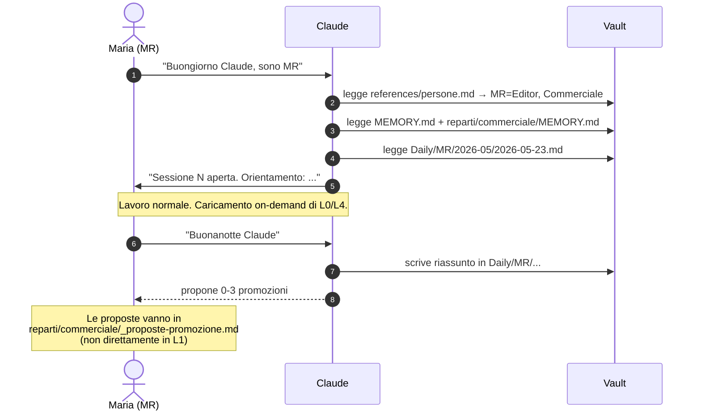
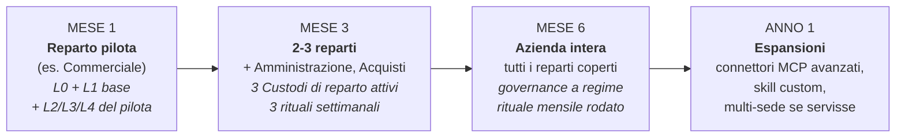

# 06 — Il framework PMI

Questo documento spiega **come funziona** il framework della wiki aziendale (vault) per una PMI. È teoria, non operatività. Se cerchi i passi pratici per la migrazione e i rituali, vai al [`05-manuale-custode.md`](05-manuale-custode.md). Se cerchi la checklist on-site, vai al [`02-kickoff-checklist.md`](02-kickoff-checklist.md).

Qui si risponde a: *perché è strutturato così, e cosa cambia rispetto al framework single-user da cui derivano queste idee.*

---

## 1. Il problema che risolviamo

Claude (e in generale gli LLM) non ha memoria tra una sessione e l'altra. Per uso personale è un piccolo fastidio. Per una **PMI con 30-50 persone, 4-6 reparti e 5-15 anni di sedimentazione documentale**, è un acceleratore di caos:

- Ogni dipendente, ogni mattina, ricomincia a "spiegare" a Claude chi è e cosa sta facendo
- La conoscenza che si genera nelle conversazioni (decisioni, lezioni, contesti su un cliente) evapora a fine sessione
- Il patrimonio documentale esistente (Drive, NAS, email) resta intoccabile — nessuno sa da dove iniziare a metterlo in ordine
- Quando entra una persona nuova, passa 3-4 settimane a "chiedere" perché non c'è un posto canonico dove guardare

Le soluzioni "memoria automatica" delegano il problema all'AI: si spera che ricordi le cose giuste. Funziona per chi lavora da solo, fallisce quando le persone sono 30+ e i ruoli sono differenziati.

Questo framework fa l'opposto: **la conoscenza aziendale vive in file che le persone giuste controllano**, e Claude li legge quando serve. Risultato: una memoria leggibile, modificabile, versionabile, multi-utente, con permessi.

---

## 2. Cos'è davvero questo framework

È un **sistema operativo della conoscenza aziendale** per lavorare con un LLM. Composto da 4 componenti che lavorano insieme:



| Componente | Risponde a | Sezioni di questo doc |
|---|---|---|
| **Memoria** | *Cosa sa la wiki?* | "I 6 layer di memoria" |
| **Protocollo** | *Quando viene letta, scritta, promossa?* | "Il protocollo a 3 livelli" |
| **Workflow** | *Come garantiamo la qualità in 30-50 persone?* | "Le 4 regole non-negoziabili" |
| **Estensioni** | *Come cresce e chi la mantiene?* | "I 4 ruoli", "Modello di crescita" |

I 4 pezzi sono interdipendenti. La memoria senza protocollo si fossilizza (scrivi e nessuno rilegge). Il protocollo senza workflow diventa cerimonia (apri/chiudi ma non incidi). Il workflow senza estensioni resta locale (non scala oltre il reparto pilota). Tutti insieme — un OS aziendale della conoscenza.

---

## 3. L'analogia con un sistema operativo, adattata alla PMI

Pensa al vault come a un sistema operativo aziendale. Ogni concetto del framework ha un corrispettivo familiare:



| Concetto OS | File nel vault | Ruolo |
|---|---|---|
| **Kernel multi-utente** | `vault/CLAUDE.md` | Routing, regole, protocollo. Riconosce chi è l'utente attivo (variabile di sessione) e applica i permessi. |
| **Firmware aziendale** | `vault/references/` | Identità aziendale stabile: chi siamo, organigramma, persone, brand voice, glossario. |
| **RAM aziendale** | `vault/MEMORY.md` | Decisioni che valgono per tutta l'azienda. Aggiornata nel rituale mensile dall'Owner. |
| **RAM di reparto** | `vault/reparti/<X>/MEMORY.md` | Decisioni di reparto. Aggiornata nel rituale settimanale dal Custode di reparto. |
| **App / Oggetti di business** | `vault/clienti/<X>/`, `fornitori/<X>/`, `commesse/<X>/` | Schede strutturate (Regola 01-PMI) per ogni oggetto. |
| **Log per persona** | `vault/Daily/<XX>/` | Diario operativo di ciascun utente. Privacy: visibile solo all'autore. |
| **Skill** | `skills/X/SKILL.md` | Moduli funzionali. Le skill principali in v1: `setup-wizard-azienda`, `setup-wizard-persona`, `session-lifecycle`, `rituale-settimanale-custode`, `rituale-mensile-owner`, `vault-lint`. |

Quando Maria (commerciale, MR) apre Cowork al mattino e scrive *"Buongiorno Claude, sono MR"*:
1. Il kernel (`CLAUDE.md`) si attiva
2. Legge `references/persone.md` → trova MR, ruolo Editor, reparto Commerciale
3. Legge `MEMORY.md` aziendale (cose che riguardano tutti)
4. Legge `reparti/commerciale/MEMORY.md` (cose che riguardano il suo reparto)
5. Legge il suo `Daily/MR/2026-05/2026-05-23.md`
6. Restituisce a Maria un orientamento sintetico

Niente carica L0 (`references/brand-voice`) finché non serve. Niente carica L4 (`clienti/rossi-srl/`) finché Maria non lavora su Rossi. L'attivazione è **on-demand per layer pesanti**, **eager per layer leggeri e generali**.

---

## 4. I 6 layer di memoria

Il framework single-user aveva 4 layer (L0-L3) perché c'era una sola persona, una sola scrivania. In PMI 30-50 servono **6 layer** perché c'è una matrice a 2 assi: *cosa* (statico vs vivo) × *chi* (azienda vs reparto vs oggetto/persona).

```
                       STATICO (cambia mesi)        VIVO (cambia giorni)
                       ────────────────────────     ───────────────────────
AZIENDA (tutti)        L0 — Identità aziendale      L1 — Memoria aziendale
                       references/                  MEMORY.md (radice)

REPARTO (team)         L2 — Procedure & playbook    L3 — Vita del reparto
                       reparti/<X>/procedure/       reparti/<X>/MEMORY.md

OGGETTO (1 cosa)       L4 — Knowledge di X          L5 — Operativo / Daily
                       clienti/<X>/, fornitori/<X>/  Daily/<XX>/
                       commesse/<X>/
```

### Tabella canonica

| Layer | Nome | Path | Cosa contiene | Frequenza scrittura | Quando viene caricato |
|---|---|---|---|---|---|
| **L0** | Identità aziendale | `vault/references/` | Chi siamo, brand voice, valori, organigramma, glossario, persone, perimetro privacy | trimestrale | on-demand quando il task richiede tono/posizionamento/glossario |
| **L1** | Memoria aziendale | `vault/MEMORY.md` | Decisioni cross-reparto, ADR aziendali sintetizzati | mensile | a ogni "Buongiorno" di chiunque |
| **L2** | Procedure & playbook | `vault/reparti/<reparto>/procedure/` | SOP, checklist, modulistica, template del reparto | mensile | quando il task tocca quel reparto |
| **L3** | Vita del reparto | `vault/reparti/<reparto>/MEMORY.md` | Decisioni di reparto, lezioni recenti | settimanale | quando apri un task del reparto |
| **L4** | Knowledge di oggetto | `vault/clienti/<X>/`, `vault/fornitori/<X>/`, `vault/commesse/<X>/` | Schede, storico, decisioni datate, persone, allegati linkati | per evento | quando apri quell'oggetto |
| **L5** | Operativo personale | `vault/Daily/<XX>/YYYY-MM/YYYY-MM-DD.md` | Journal della persona, sparks, suoi task | quotidiana | sempre, per la persona loggata |

### Esempio caricamento concreto

> **Maria** (MR, commerciale, Editor) apre alle 9:00. Claude legge L1 + L5 di MR + L3 di Commerciale.
> Alle 9:30 lavora su offerta Rossi Srl → Claude carica L4 (`clienti/rossi-srl/`).
> Apre template offerta → richiama L2 (`reparti/commerciale/procedure/sop-offerte.md`).
> Stesura testo → L0 (`references/brand-voice.md`) on-demand.
> Mai tutto insieme. **Carico medio per sessione: 30-60 KB di Markdown.** Sostenibile.

### Regola di promozione (dal basso verso l'alto)

Una cosa nasce **quasi sempre in L5** (un'idea, una decisione presa al volo durante un lavoro). Se si rivela utile per il reparto, **sale a L3 o a L2**. Se si rivela utile per tutta l'azienda, **sale a L1**. Se diventa parte stabile dell'identità aziendale, **sale a L0** (raro, qualche volta all'anno).

Le promozioni non sono automatiche — sono giudizi. Sono il cuore dei 3 rituali (vedi sezione 6).

---

## 5. I 4 ruoli (+ 1 lettore)

Una wiki single-user ha un utente. Una wiki PMI 30-50 ha **4 ruoli operativi** con poteri differenziati, più i lettori esterni.

| Ruolo | Quanti per azienda | Cosa fa | Cosa NON fa |
|---|---|---|---|
| **Owner** | 1 (Direzione) | Approva L0 e L1. Decide perimetro. Firma decisioni cross-reparto e ADR aziendali. Partecipa al rituale mensile | Non scrive contenuti operativi |
| **Custode capo** | 1 (l'IT/Office manager) | Coordina Custodi di reparto. Mantiene `references/`. Conduce il rituale mensile. Gestisce le skill | Non decide contenuto di business dei reparti |
| **Custode di reparto** | 1 per reparto (3-5 in PMI 30-50) | Garantisce salute L2/L3 del suo reparto. Conduce il rituale settimanale. Tiene puliti template e procedure | Non decide contenuto di business di reparti altrui |
| **Editor** | 3-8 a seconda taglia | Scrive e revisiona L2/L3/L4. Tipicamente senior di ogni reparto | Non tocca L0/L1 senza Owner |
| **Contributor** | tutti gli altri (15-30+) | Scrive bozze in L4/L5. Logga la propria giornata in L5 | Non merge in L1/L2 da solo |
| *(Lettore)* | esterni (tirocinanti, fornitori, partner) | Solo lettura | Tutto il resto |

### Identificazione: `vault/references/persone.md`

```markdown
| Iniziali | Nome           | Reparto         | Ruolo wiki         | Email                    |
|----------|----------------|-----------------|--------------------|--------------------------|
| AF       | Anna Ferrari   | Direzione       | Owner              | a.ferrari@azienda.it     |
| GB       | Giulia Bianchi | IT/Office       | Custode capo       | g.bianchi@azienda.it     |
| MR       | Maria Rossi    | Commerciale     | Editor + Custode   | m.rossi@azienda.it       |
| LV       | Luca Verdi     | Commerciale     | Contributor        | l.verdi@azienda.it       |
| ...      | ...            | ...             | ...                | ...                      |
```

### Frontmatter dei file: permessi nel singolo file

```yaml
---
tipo: scheda-cliente
cliente: rossi-srl
owner: MR
editor: [MR, LV, GB]
visibilita: reparto            # azienda | reparto | privato
stato: vivo                    # bozza | vivo | archiviato
ultima-revisione: 2026-05-23
revisore: GB
---
```

Claude, prima di scrivere, legge il frontmatter e applica i permessi. Se l'utente attivo (variabile sessione: si dichiara con "Buongiorno Claude, sono MR") non è in `editor`, **rifiuta** e propone bozza in `_bozze/`.

### Variabile utente attivo

L'utente, all'apertura della sessione, dice *"Buongiorno Claude, sono [iniziali]"*. Claude scrive le iniziali in una variabile di sessione e da quel momento:
- Filtra permessi sui file (frontmatter `editor`)
- Scrive log nel `Daily/<XX>/` corretto
- Le promozioni proposte le firma con le sue iniziali
- Se la persona non è in `references/persone.md`, Claude chiede di registrarla via skill `setup-wizard-persona` prima di procedere

Se le iniziali non sono dichiarate, Claude chiede *"chi sei?"* prima di scrivere.

---

## 6. Il protocollo a 3 livelli

Sostituisce il Buongiorno/Buonanotte single-user con un'orchestrazione su tre tempi.

### Livello 1 — Personale (giornaliero, ogni dipendente)

**Skill**: `session-lifecycle`.



Le promozioni proposte alla sera **non vanno mai direttamente in L1**. Vanno in `reparti/<X>/_proposte-promozione.md`, in attesa che il Custode di reparto le rivedi nel rituale settimanale.

### Livello 2 — Reparto (settimanale, Custode di reparto)

**Skill**: `rituale-settimanale-custode`.

Ogni venerdì pomeriggio, 30 minuti, il Custode di reparto:

1. Apre `reparti/<X>/_proposte-promozione.md`
2. Per ogni proposta decide: sale a L3 / sale a L2 (nuova SOP) / candidata a L1 / scartata
3. Aggiorna `reparti/<X>/MEMORY.md`
4. Lancia `vault-lint`, risolve eventuali errori
5. Pulisce `_pending/da-chiarire.md` del reparto

### Livello 3 — Azienda (mensile, Owner + tutti i Custodi)

**Skill**: `rituale-mensile-owner`.

Primo venerdì del mese, 1 ora:

1. Owner + Custodi rivedono **candidate a L1** (proposte salite dai 4 rituali settimanali del mese)
2. Owner decide quali entrano in `vault/MEMORY.md` aziendale
3. Owner firma ADR cross-reparto in `vault/decisioni/`
4. Si guarda salute del vault: trend file vivi, MOC mancanti, reparti silenti, costo Claude mensile

---

## 7. Le 4 regole non-negoziabili

3 mantenute dal framework single-user (rafforzate per multi-utente), 1 nuova (anti-Drive-caotico).

### Regola 1 — La Regola della Bozza (rafforzata)

Il vault è dove **leggi e scrivi prima**. L'output (binari, deliverable) è dove **consegni dopo**.

Ordine fisso, con review se più Editor:

1. **Leggi** → i file rilevanti (L0/L1/L2/L3/L4 a seconda del task)
2. **Bozza** `.md` con `stato: bozza` nel posto giusto
3. **Review interna** (se Editor multipli sul file)
4. **OK Owner** (se la bozza tocca L0/L1)
5. **Binario** finale con naming `[cliente]_[tipo]_v[n]_YYYY-MM-DD.[ext]`

Saltare lo step 3 o 4 in multi-utente significa documenti contraddittori in giro per la wiki. È la fonte principale di disordine post-handover.

### Regola 2 — Regola 01-PMI (5 file invece di 4)

Ogni oggetto in `clienti/`, `fornitori/`, `commesse/`, `processi/`:

- `<slug>.md` (MOC — hub che linka a tutto)
- `CLAUDE.md` (istruzioni specifiche per l'oggetto)
- `MEMORY.md` (decisioni datate)
- `tasks.md` (task aperti)
- `persone.md` ← **NUOVO 5° file** (chi è chi, da entrambi i lati: persone nostre che lavorano su questo, persone del cliente/fornitore)

Opzionali: `riunioni/`, `knowledge/`, `post-mortem/`, `_archivio/`.

Il 5° file `persone.md` è la differenza più importante rispetto al framework single-user. In PMI ogni oggetto di business ha 3-10 persone coinvolte (nostre + loro), con ruoli, contatti, preferenze. Senza un posto canonico per scriverle, ognuno se le segna in fondo a una mail e si perde.

### Regola 3 — Verify-or-redo (estesa)

Dopo ogni modifica, **esegui davvero il check** che farebbe l'utente finale del documento. In multi-utente si aggiunge: la verifica include il **canale di pubblicazione** (binario salvato nel posto giusto con naming convenzionale, accessibile a chi serve).

1. Capisci cosa significa "funzionante" dal punto di vista di chi userà
2. Esegui la modifica
3. Verifica come la verificherebbe l'utente
4. Se fallisce, loop: diagnosi, fix, verifica
5. Pubblica nel canale giusto con naming standard
6. Solo allora conferma

### Regola 4 — SSOT per oggetto (NUOVA, anti-Drive-caotico)

**Single Source Of Truth per ogni oggetto di business.** Per ogni cliente, fornitore, commessa, persona esiste **un solo file di verità nel vault**. Tutto il resto (allegati Drive, righe Excel, mail) linka a quel file o ci viene riconciliato.

È la regola che protegge dal pattern che ammazza i Drive aziendali: stessa informazione scritta in 3 posti, due si aggiornano, uno resta vecchio, il terzo è quello che la persona nuova trova per prima.

Operativamente: prima di scrivere una nuova nota su Rossi Srl, vai in `clienti/rossi-srl/<slug>.md` (MOC) e vedi cosa c'è. Se l'informazione c'è già, aggiorna lì. Se non c'è, aggiungila lì. Mai due posti per la stessa cosa.

---

## 8. Gli 8 pattern di scrittura

Ognuno di questi pattern ha un esempio `_esempio/` nel vault, un template e un caso d'uso reale.

| # | Pattern | Path | Quando si usa |
|---|---|---|---|
| 1 | **Verbale riunione** | `reparti/<X>/riunioni/YYYY-MM-DD_titolo.md` o `clienti/<X>/riunioni/...` | Dopo una riunione interna o con cliente |
| 2 | **SOP (procedura)** | `reparti/<X>/procedure/sop-<slug>.md` | Quando una pratica si ripete 3+ volte e va codificata |
| 3 | **Scheda cliente** | `clienti/<X>/<X>.md` (MOC) + 4 file Regola 01-PMI | Nuovo cliente acquisito |
| 4 | **Scheda fornitore** | `fornitori/<X>/<X>.md` simile a cliente | Nuovo fornitore strategico |
| 5 | **Post-mortem** | `reparti/<X>/post-mortem/...` con timeline, azioni correttive, candidate promozione | Dopo un problema rilevante (cliente perso, commessa in perdita, errore caro) |
| 6 | **ADR (Architectural Decision Record)** | `vault/decisioni/YYYY-MM-DD_titolo.md` numerato (014, 015...) | Decisione strutturale che cambia processi o relazioni durature |
| 7 | **Onboarding role-based** | `reparti/<X>/onboarding/<ruolo>.md` (giorno 1, 2, 3...) | Quando entra una persona nuova in un ruolo già visto |
| 8 | **Contatti / rubrica** | `reparti/<X>/contatti.md` (tabella clienti/fornitori/interni/emergenze) | Per ogni reparto, almeno uno |

Ogni pattern ha:
- Frontmatter standard (vedi sezione "Frontmatter dei file" sopra)
- Struttura base di 5-8 righe da copiare
- Almeno un caso d'uso reale dell'azienda

---

## 9. Modello di crescita

Il framework scala da 1 reparto a tutta l'azienda. **Non hai bisogno di tutto subito — anzi, *non devi*.**



| Fase | Investimento | Cosa funziona | Cosa NON serve ancora |
|---|---|---|---|
| **Mese 1** | 30-50 ore (delivery prodotto) + 3-4h/sett Custode pilota | Reparto pilota a regime. Buongiorno/Buonanotte per chiunque del pilota. | Altri reparti, governance multi-Custode, skill custom |
| **Mese 3** | ~3 ore/sett Custode capo (coordinamento) + 3-4h/sett ciascun Custode di reparto | 2-3 reparti attivi. Rituale settimanale x reparto. Rituale mensile fissato. | Connettori MCP avanzati, multi-sede |
| **Mese 6** | ~5 ore/sett Custode capo + 2-3h/sett ciascun Custode | Azienda intera coperta. Mole vault: 1-2 GB di `.md`. Drive in sola lettura per i reparti migrati. | Skill custom per casi rari |
| **Anno 1** | A consumo, su giustificazione | Skill ad-hoc quando il caso d'uso lo giustifica (es. estrazione automatica trascrizioni call commerciali). Connettori MCP per CRM/gestionale se l'integrazione esiste. | — (sei a regime) |

**La regola d'oro: non saltare le fasi.** Aprire 4 reparti al mese 1 = caos garantito. Costruire skill custom al mese 1 = pesce fuor d'acqua. Il sistema funziona perché la disciplina dei rituali diventa abitudine **prima** di aggiungere complessità.

---

## 10. Cosa NON è questo framework

- **Non è un'integrazione automatica con il gestionale italiano** (TeamSystem, Zucchetti, ecc.). Quelli, se hanno API, si raggiungono via MCP custom — non in v1.
- **Non è una memoria magica**. È una struttura di file che le persone giuste mantengono.
- **Non è un sostituto di Drive/SharePoint/NAS**. Il vault contiene `.md` + link. Il patrimonio binario resta dove sta.
- **Non è specifico di Claude**. La struttura funziona con qualunque LLM che sappia leggere file. Le skill sono ottimizzate per Claude.
- **Non è change management**. Documenta processi, non li ridisegna. Se il problema è organizzativo, il vault lo evidenzia ma non lo risolve.

---

## 11. Riepilogo

| Componente | Cosa |
|---|---|
| **Memoria** | 6 layer (L0-L5) lungo 2 assi: statico/vivo × azienda/reparto/oggetto |
| **Ruoli** | 4 + 1: Owner, Custode capo, Custodi di reparto, Editor, Contributor, (Lettore) |
| **Regole** | 4: Bozza, Regola 01-PMI (5 file), Verify-or-redo, SSOT per oggetto |
| **Protocollo** | 3 livelli: personale giornaliero, reparto settimanale, azienda mensile |
| **Pattern** | 8 pattern di scrittura standard |
| **Crescita** | Reparto pilota (mese 1) → 2-3 reparti (mese 3) → azienda (mese 6) |

Il framework non è "tanto" — è *quel che basta* per non perdere la conoscenza aziendale e per consentire a 30-50 persone di lavorare con Claude senza calpestarsi. Tutto il resto è esecuzione disciplinata: scrivere nel posto giusto, sedimentare nei rituali, non saltare il Verify-or-redo, non duplicare la SSOT.

---

## Documenti collegati

- [`01-cosa-vendi.md`](01-cosa-vendi.md) — il framework nel pitch commerciale
- [`02-kickoff-checklist.md`](02-kickoff-checklist.md) — come si istanzia in mezza giornata
- [`03-scandagliamento.md`](03-scandagliamento.md) — come si popola in 1-2 settimane
- [`04-handover-checklist.md`](04-handover-checklist.md) — come si trasferisce al cliente
- [`05-manuale-custode.md`](05-manuale-custode.md) — come si mantiene per sempre
- [`07-manuale-persone.md`](07-manuale-persone.md) — la pagina per chi usa il vault ma non lo gestisce
