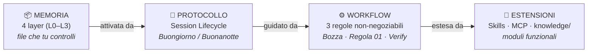
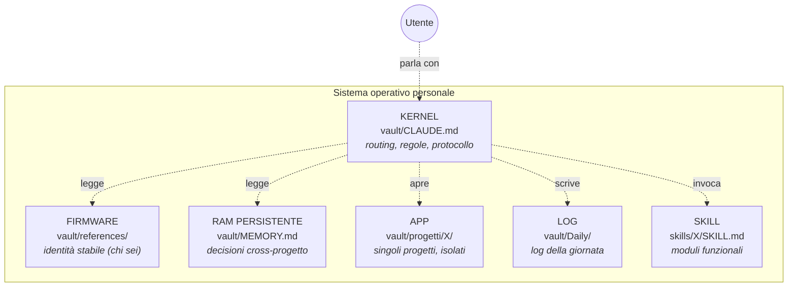
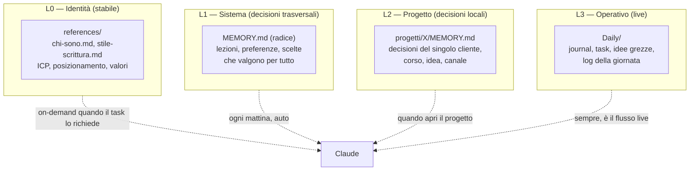
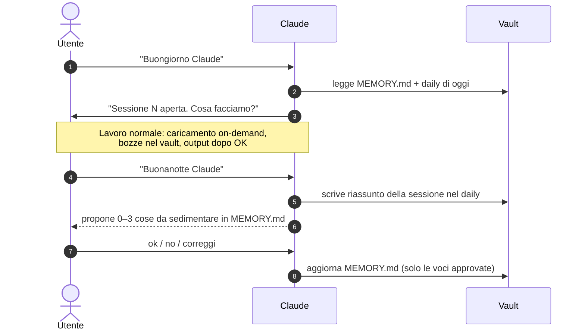
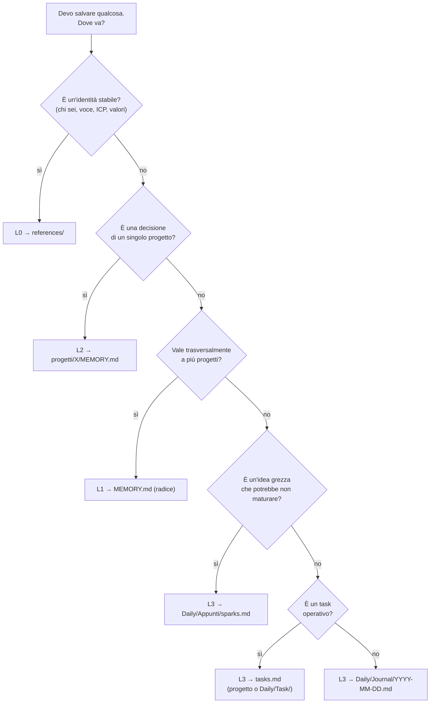
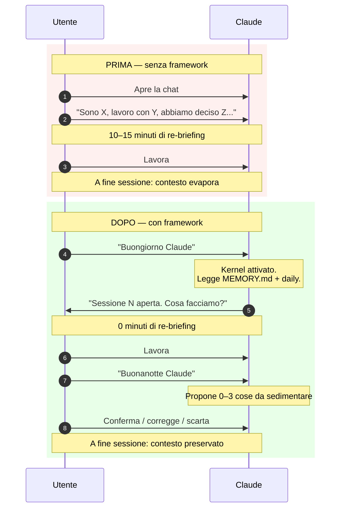
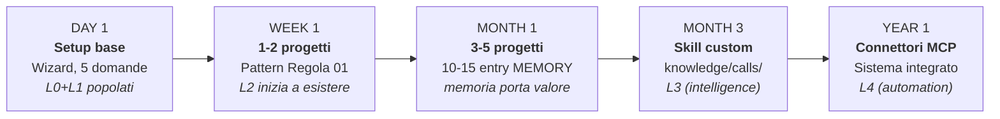

# Il framework

Questo documento spiega **come funziona** il sistema. Se vuoi solo installarlo, leggi `README.md`. Se vuoi capire perché è strutturato così — e adattarlo al tuo caso — sei nel posto giusto.

---

## Il problema

Claude (e in generale gli LLM) non ha memoria tra una sessione e l'altra. Ogni volta che apri una conversazione, riparte da zero.

Per chi usa Claude in modo occasionale non è un problema. Per chi ci lavora — come consulente, freelancer, content creator, formatore — diventa un tetto: non puoi andare in profondità su un cliente, un progetto, una decisione, perché il contesto evapora a fine sessione.

Le soluzioni "memoria automatica" delegano il problema all'AI: tu speri che ricordi le cose giuste. Questo framework fa l'opposto: **la tua conoscenza vive in file che tu controlli**, e Claude li legge quando serve. Il risultato è una memoria leggibile, modificabile, versionabile.

---

## Cos'è davvero questo framework

Risolvere la memoria è il punto d'ingresso. Ma il framework non si esaurisce lì.

È un **sistema operativo personale** per lavorare con un LLM, composto da 4 componenti che lavorano insieme:



| Componente | Risponde a | Sezioni di questo doc |
|---|---|---|
| **Memoria** | *Cosa sa Claude di me?* | "I 4 layer di memoria" |
| **Protocollo di sessione** | *Quando viene letta e aggiornata?* | "La Session Lifecycle" |
| **Workflow** | *Come consegna qualità?* | "Le 3 regole non-negoziabili", "La Filing Rule" |
| **Estensioni** | *Come cresce con me?* | "Modello di crescita", `skills/`, MCP |

I 4 pezzi sono interdipendenti. La memoria senza protocollo si fossilizza (scrivi e poi non rileggi mai). Il protocollo senza workflow diventa cerimonia (apri/chiudi ma non incidi). Il workflow senza estensioni resta locale (non scala oltre il tuo caso). Tutti insieme — un OS personale.

---

## L'analogia con un sistema operativo

Pensa al vault come a un sistema operativo personale. Ogni concetto del framework ha un corrispettivo familiare nel mondo OS:



| Concetto OS | File nel vault | Ruolo |
|---|---|---|
| **Kernel** | `vault/CLAUDE.md` | Routing, regole, protocollo. Il "primo file letto" — definisce come tutto il resto va interpretato. |
| **Firmware** | `vault/references/` | Identità stabile. Cambia di rado. Caricato on-demand quando il task lo richiede. |
| **RAM persistente** | `vault/MEMORY.md` | Decisioni che valgono nel tempo. Letta ogni mattina, aggiornata ogni sera. |
| **App** | `vault/progetti/X/` | Singoli progetti, isolati. Ogni "app" ha la stessa struttura (Regola 01). |
| **Log** | `vault/Daily/` | Diario della giornata, task, idee grezze. Il flusso live. |
| **Skill** | `skills/X/SKILL.md` | Moduli funzionali. Estendono il kernel. Il setup-wizard è la prima skill che incontri. |

L'analogia non è solo metaforica: il framework si comporta letteralmente come un OS. Quando dici *"Buongiorno Claude"*, il kernel (CLAUDE.md) si attiva, legge la RAM (MEMORY.md), prepara il context, e ti restituisce il prompt iniziale. Quando apri un progetto, lui istanzia l'app (carica i 4 file della Regola 01) e tu ci lavori dentro. È un OS, non una metafora di OS.

---

## I 4 layer di memoria

La memoria non è uniforme. Ci sono cose che cambiano ogni giorno e cose che restano stabili per anni. Mescolarle è il modo più rapido per rendere il sistema inutilizzabile.

Il framework separa la memoria in 4 layer, ognuno con un proprio ruolo, una propria frequenza di aggiornamento, e un proprio momento di caricamento.



**L0 — Identità.** Chi sei, come scrivi, con chi lavori, qual è la tua strategia. Sta in `references/`. È il livello che cambia di rado: una volta scritto bene, dura mesi. Si carica **solo quando il task lo richiede** — Claude non legge `references/` all'apertura, lo carica quando deve scrivere un contenuto, fare un'analisi, parlare in un certo tono.

**L1 — Sistema.** Decisioni e lezioni che valgono trasversalmente a tutti i progetti. "Ho deciso di non lavorare su weekend", "il mio fornitore X è inaffidabile", "uso sempre il modello Y per le proposte". Sta in `MEMORY.md` alla radice del vault. Si carica **ogni mattina** quando apri la sessione: è la "RAM persistente" del sistema.

**L2 — Progetto.** Decisioni e contesto specifici di un singolo progetto. "Su questo cliente abbiamo deciso di evitare slide", "questo corso ha un budget di X", "questa idea è in fase di validazione, non di sviluppo". Sta in `progetti/X/MEMORY.md`. Si carica **quando apri quel progetto** — non prima.

**L3 — Operativo.** Il log della giornata, i task attivi, le idee grezze, i fatti da promuovere o scartare. Sta in `Daily/`. È il flusso live, dove le cose succedono prima di sedimentare nei layer più stabili.

**Regola di promozione.** Una cosa nasce quasi sempre in L3 (un'idea, una decisione presa al volo). Se ritorna, sale a L2. Se vale per più progetti, sale a L1. Se diventa parte stabile della tua identità, sale a L0. Le promozioni vanno fatte a mano, perché sono giudizi — non automazioni.

---

## Le 3 regole non-negoziabili

Il framework funziona se rispetti tre regole. Se le ignori, il sistema collassa nel giro di poche settimane.

### 1. La Regola della Bozza

Il vault è dove **leggi e scrivi prima**. L'output (file binari, deliverable, codice di produzione) è dove **consegni dopo**.

Ordine fisso:

1. **Leggi** — i file rilevanti (L0/L1/L2 a seconda del task)
2. **Bozza** — prima stesura `.md` nel vault, nel posto giusto
3. **Attendi** — l'OK esplicito ("ok produci", "fai il docx", "esporta")
4. **Produci** — il binario nella cartella di output, con naming coerente

Saltare lo step 3 è la fonte principale di rilavoro. Claude (o tu) sembra "fare in fretta", ma ti porta a esportare 12 versioni di un file invece di iterare sulla bozza.

**Eccezioni**: richiesta diretta di binario ("fammi il pptx"), input dal cliente, modifica puntuale a un deliverable esistente.

### 2. La Regola 01 — invariante di progetto

Ogni progetto, indipendentemente dal tipo (cliente, corso, idea, canale), ha la stessa struttura:

```
progetti/[nome-progetto]/
├── [nome-progetto].md     # MOC — hub che linka a tutto
├── CLAUDE.md              # istruzioni specifiche del progetto
├── MEMORY.md              # decisioni datate
├── tasks.md               # task locali
└── knowledge/             # documenti di riferimento, transcript call
    └── calls/             # trascrizioni meeting (opzionale, on-demand)
```

L'invariante serve per due motivi: (1) Claude sa sempre cosa caricare quando apri un progetto, senza dover esplorare; (2) puoi muoverti tra progetti diversi senza imparare layout diversi.

### 3. Il Verify-or-redo loop

Dopo ogni modifica, **esegui davvero il check che farebbe l'utente finale**. Niente "fatto" basato su come *sembra*.

1. **Capisci** cosa significa "funzionante" dal punto di vista di chi userà il risultato
2. **Esegui** la modifica
3. **Verifica** come la verificherebbe l'utente: apri il file, leggi il contenuto, prova il flusso, confronta con l'aspettativa
4. **Se fallisce, loop**: diagnosi, fix, verifica di nuovo
5. **Solo allora conferma**

È la regola che separa un sistema affidabile da uno "che sembrava funzionare".

---

## La Session Lifecycle

Il framework definisce un protocollo di apertura e chiusura della sessione. Due frasi, un risultato: la memoria sopravvive senza che tu debba ricordarti di scriverla.



**Il valore non è "Buongiorno Claude" — è il fatto che la chiusura sia un protocollo, non un'iniziativa.** Senza protocollo di chiusura, le decisioni prese durante la sessione si perdono. Con il protocollo, ogni sera il sistema chiede *"Cosa di oggi vale la pena ricordare?"* e tu rispondi con un sì/no/correggi. Costo: 60 secondi.

---

## La Filing Rule (dove va questa cosa?)

Ogni elemento ha **un solo posto giusto**. La regola del *first match* dice: usa il primo posto che combacia, non cercare il "migliore".



**Quando sei in dubbio, scegli il livello più operativo (L3) e lascia che la promozione lo faccia salire**. È più facile promuovere dal basso che ridiscendere da troppo in alto.

---

## Cosa cambia nella tua giornata

Concretamente, vista in sequenza, la differenza tra una sessione *senza* framework e una *con* framework:



Lo guadagno non è solo tempo (10-15 min × N sessioni a settimana). È **profondità**: puoi finalmente costruire conversazioni che si evolvono nel tempo invece di ricominciare da zero.

---

## Modello di crescita

Il framework scala dal Day 1 al Year 1. Non hai bisogno di tutto subito — anzi, *non devi*.



| Fase | Investimento | Cosa funziona | Cosa NON serve ancora |
|---|---|---|---|
| **Day 1** | 10 min | Buongiorno/Buonanotte. Memoria base. | Nessun progetto, nessuna skill custom. |
| **Week 1** | 1-2 ore | Primo cliente/progetto reale aperto con la Regola 01. | Top-level multiple, MCP, automazioni. |
| **Month 1** | ~30 min/settimana | Sistema iniziato a "ricordare". Sedimentazione visibile. | Skill personalizzate. |
| **Month 3** | Skill ad-hoc quando servono | Trascrizioni call, vault-lint regolari, pattern di pipeline. | Connettori MCP complessi. |
| **Year 1** | Estensioni MCP per workflow autonomi | Sistema integrato con Gmail/Calendar/Asana. | — (sei a regime). |

**La regola d'oro: non saltare le fasi.** Costruire skill custom al Day 1 è un anti-pattern. Il sistema funziona perché la disciplina dei layer 1-2 diventa abitudine *prima* di aggiungere complessità.

---

## Cosa NON è questo framework

Per chiarezza, alcune cose che il framework **non fa** e non promette:

- **Non è un'integrazione automatica con tool esterni** (Gmail, Slack, Stripe, gestionali). Quelli si chiamano *connettori* o *MCP* e vivono al di sopra del framework. Il framework dà la struttura della memoria — gli MCP danno l'accesso ai dati.
- **Non è una memoria magica**. È una struttura di file che tu mantieni. Se non scrivi nulla in `MEMORY.md`, il sistema è vuoto.
- **Non è un sostituto di un PM/Notion/Obsidian**. È un'architettura di file che funziona dentro Obsidian, dentro Cowork, dentro Claude Code, dentro un editor di testo qualsiasi.
- **Non è specifico di Claude**. La struttura funziona con qualunque LLM che sappia leggere file. È stato testato con Claude perché è il caso d'uso primario, ma il pattern è agnostico.

---

## Come applicarlo al tuo caso

Tre livelli di adozione, in ordine.

### Livello 1 — Setup base (10 minuti)

Cloni il repo, lanci il setup-wizard. Risponde alle 5 domande di L0 (identità) e il sistema genera i tre file chiave: `vault/CLAUDE.md`, `vault/MEMORY.md`, `vault/references/chi-sono.md`. Da quel momento puoi usare *Buongiorno Claude / Buonanotte Claude*.

### Livello 2 — Adozione progetto (10 min per progetto)

Ogni volta che inizi un nuovo cliente / corso / idea, crei una cartella `progetti/[nome]/` con i 4 file della Regola 01 (MOC, CLAUDE.md, MEMORY.md, tasks.md). Puoi copiare `progetti/_esempio/` come scaffold.

Bastano 2-3 progetti per cominciare a sentire il valore: la prossima volta che riapri uno di quei progetti, Claude ha già il contesto.

### Livello 3 — Estensioni (quando serve)

Quando il sistema base diventa stretto, le estensioni naturali sono:

- **Top-level personalizzate**: invece di un'unica cartella `progetti/`, dividi in `Lavoro/`, `Contenuti/`, `Formazione/`, `Idee/`. Vedi `docs/da-base-a-avanzato.md` (in arrivo).
- **Skill specifiche**: `pipeline-content`, `meet-sync`, `vault-lint`. Sono moduli che aggiungi quando il caso d'uso lo giustifica, non prima.
- **Integrazioni MCP**: connetti Gmail, Calendar, Asana, ecc. Il framework non te le dà — te le predispone (in `MEMORY.md` annoti quali tool vorrai automatizzare).

**Resistere alla tentazione di partire dal Livello 3.** Funziona solo se i Livelli 1-2 sono diventati abitudine.

---

## Riepilogo

Quattro layer di memoria, tre regole, un protocollo di sessione, una regola di filing. È tutto qui.

Il framework non è "tanto" — è *quel che basta* per non perdere il contesto. Tutto il resto è esecuzione disciplinata: scrivere nel posto giusto, sedimentare ogni sera, non saltare il Verify-or-redo.

Per iniziare: torna al `README.md` e segui i 5 minuti di setup.
